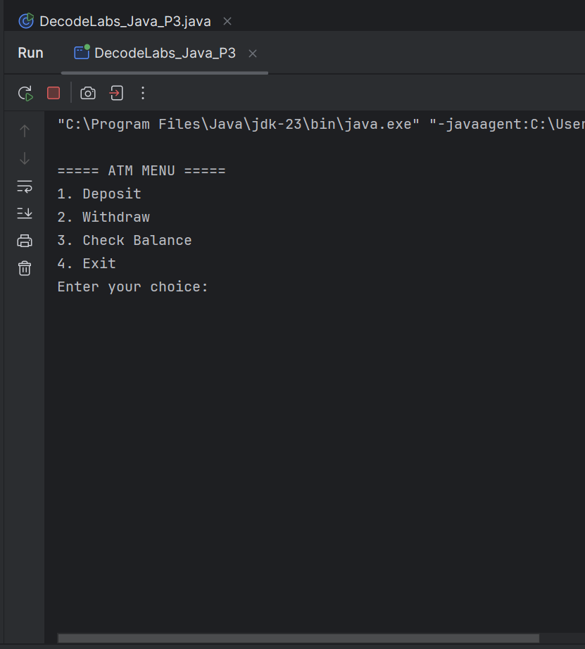
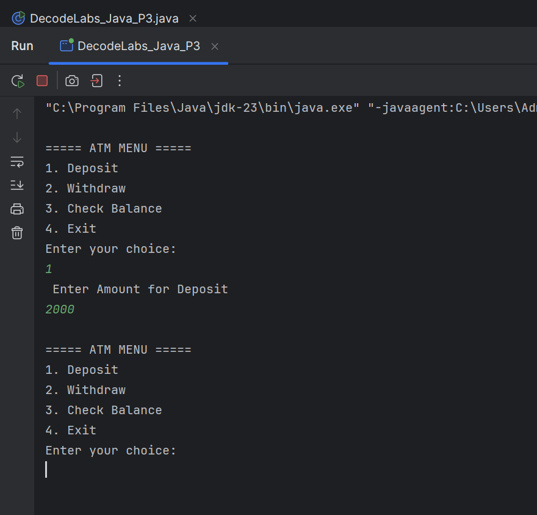
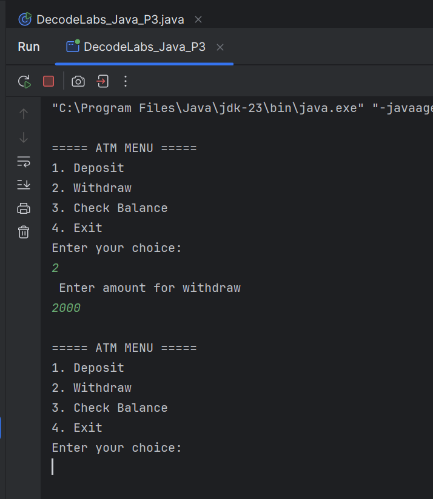
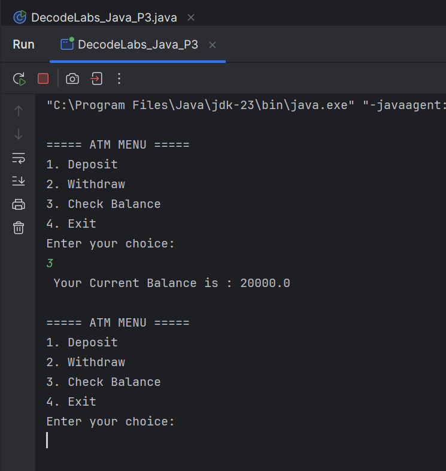
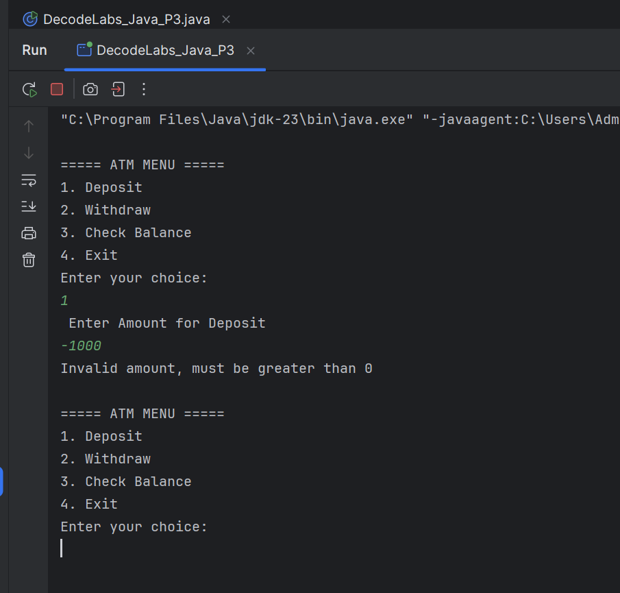

# Project 3 — ATM Interface

## 1. Project Overview

The ATM Interface is a console-based Java application developed as
Project 3 for the DecodeLabs Java Programming Internship (Batch 2026).

This project introduces Object-Oriented Programming (OOP) concepts by
simulating a basic ATM system. The program allows users to deposit money,
withdraw money, check their account balance, and exit the system through
a menu-driven interface.

The application uses a `BankAccount` class to encapsulate account data
and transaction logic, while the `DecodeLabs_Java_P3` class handles user
interaction and the ATM menu.

---

## 2. Objectives

The main objectives of this project are:

- To understand and implement Object-Oriented Programming concepts.
- To create and use classes and objects in Java.
- To implement encapsulation using private fields and public methods.
- To practice constructors, getters, and setters.
- To implement a menu-driven ATM interface.
- To validate deposits and withdrawals.
- To prevent withdrawals that exceed the available balance.
- To practice loops and switch-case statements.

---

## 3. Technologies Used

- **Programming Language:** Java
- **User Input:** `java.util.Scanner`
- **Development Environment:** VS Code / IntelliJ IDEA

---

## 4. Features

### Menu-Driven Interface

The program provides a continuously running menu with the following
options:

- Deposit Money
- Withdraw Money
- Check Balance
- Exit

### Deposit

The user can deposit money into the bank account. The program validates
the entered amount and rejects zero or negative values.

### Withdraw

The user can withdraw money from the account. The program checks whether
the entered amount is valid and whether sufficient balance is available.

### Balance Check

The user can check the current account balance at any time.

### Input Validation

The program validates transaction amounts and prevents invalid transactions
from being processed.

### Encapsulation

The `BankAccount` class keeps account information private and provides
public methods to safely access and modify the account data.

---

## 5. Concepts Used

This project demonstrates the following Java and OOP concepts:

- Classes and objects
- Encapsulation
- Private fields
- Public methods
- Constructors
- Getters and setters
- Method design
- `do-while` loop
- `switch` statement
- Conditional statements
- User input using `Scanner`
- Input validation
- Basic business logic

---

## 6. Program Flow

The program follows these steps:

1. Create a `BankAccount` object.
2. Display the ATM menu.
3. Ask the user to select an operation.
4. Process the selected operation.
5. Validate the transaction amount.
6. Update the account balance when the transaction is valid.
7. Display the appropriate transaction feedback.
8. Continue displaying the menu until the user selects Exit.
9. End the program.

---

## 7. Screenshots

### ATM Start



### Deposit



### Withdraw



### Balance Check



### Invalid Transaction



---

## 8. How to Run

Clone the repository and navigate to the project directory.

Compile the Java file:

```bash
javac DecodeLabs_Java_P3.java